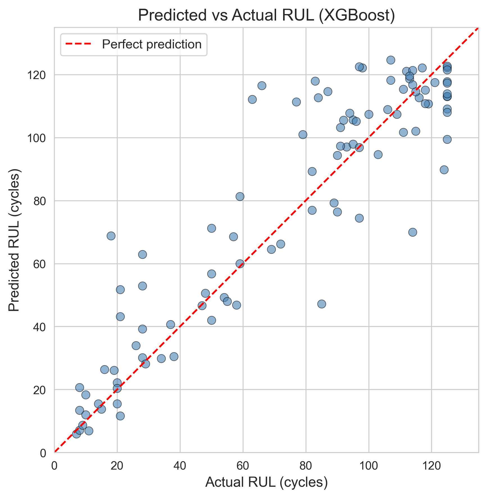
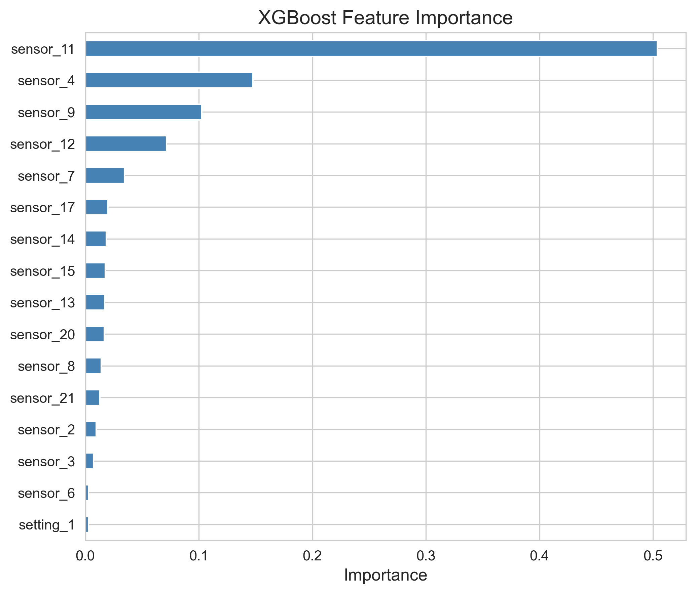

# Predictive Maintenance - Turbofan Engine RUL Prediction

## Overview
Machine learning project for predicting the **Remaining Useful Life (RUL)** of turbofan engines using the NASA C-MAPSS dataset. Three regression models are compared, with XGBoost achieving the best performance.

## Dataset
- **Source**: [NASA Prognostics Center - C-MAPSS](https://data.nasa.gov/Aerospace/CMAPSS-Jet-Engine-Simulated-Data/ff5v-kuh6)
- **FD001**: 100 engines, 20,631 samples, 21 sensors, single operating condition, single fault mode (HPC degradation)

## Results (FD001)

| Model | RMSE | MAE | R² |
|---|---|---|---|
| Linear Regression | 21.68 | 17.61 | 0.723 |
| Random Forest | 18.77 | 13.58 | 0.792 |
| **XGBoost** | **18.72** | **13.31** | **0.793** |

**Test Set (XGBoost)**: RMSE = 16.73, MAE = 11.83, R² = 0.826

### Key Figures

<p align="center">
  
  
</p>

## Project Structure
```
├── CMaps/                  # Raw C-MAPSS dataset (not tracked)
├── notebooks/
│   ├── 01_RUL_Prediction_FD001.ipynb   # Full analysis pipeline
│   └── 02_Generate_Report.ipynb        # Generate figures for report
├── results/
│   ├── figures/            # High-res figures (300 DPI)
│   ├── report.tex          # LaTeX technical report source
│   └── report.pdf          # Compiled 6-page report
├── requirements.txt
└── README.md
```

## Setup
```bash
pip install -r requirements.txt
```

## Technical Report
A 6-page LaTeX report is available at [`results/report.pdf`](results/report.pdf), covering data description, methodology, and full results analysis.

To recompile:
```bash
cd results && tectonic report.tex
```
